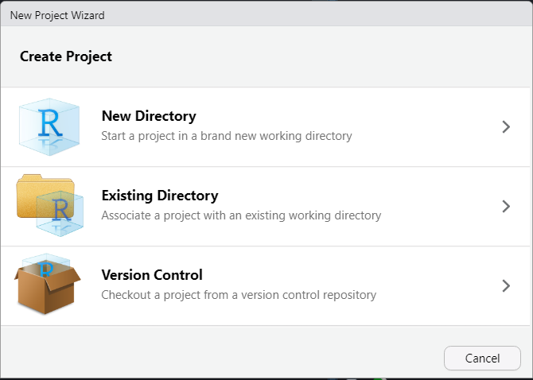
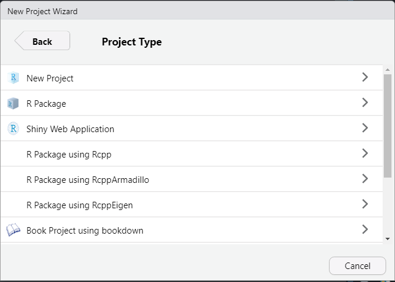
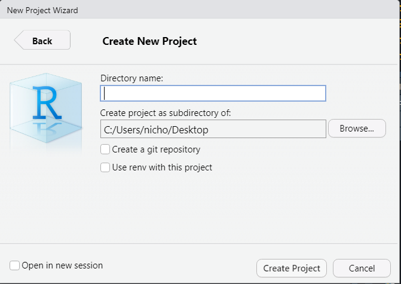

```{r setup, include=FALSE}
options(htmltools.dir.version = FALSE)
```

class: main

# Project Based Workflow:

### Working Directory

```{r, echo = FALSE, out.width="40%"}

```

--

A working directory is the folder on your computer that RStudio (or any other software) is working from. For programs like Word and Pages, this is usually your Documents folder.

---

class: main

# Project Based Workflow:

### Working Directory

We can see the current working directory by running the `getwd` command in the console.

```{r}
getwd()
```

--

We can set the working directory by adding this code to our script file.* 

```{r, eval = FALSE}
setwd("C:/File/Path/That/Only/Exists/On/My/Computer")
```

--

.footer[*This is a bad idea.]
---

class: main

# Project Based Workflow:

### Demo: 

* Create a folder called "demo" somewhere on your computer.

--

* Download the files from this mornings email and save them to that folder.

--

* Open and run the script "bad_file_demo.R" without making any changes.

--

## *What went wrong?*

--

```{r, eval = FALSE}
setwd("C:/File/Path/That/Only/Exists/On/My/Computer")
```

---

class: main

# Project Based Workflow:

### Projects!

<div class="clearfix">
  <div class="img-container">
    
  </div>
</div>

---

class: main

# Project Based Workflow:

### Projects!

<div class="clearfix">
  <div class="img-container">
    
  </div>
  <div class="img-container">
    
  </div>
</div>

---

class: main

# Project Based Workflow:

### Projects!

<div class="clearfix">
  <div class="img-container">
    
  </div>
  <div class="img-container">
    
  </div>
  <div class="img-container">
    
  </div>
</div>

--

* Name you project directory anything you'd like. I'd recommend "stat242" or something similar.

--

* Move the "demo" folder into that directory. 

--

* Open and run the "good_file_demo.R" without making any changes.